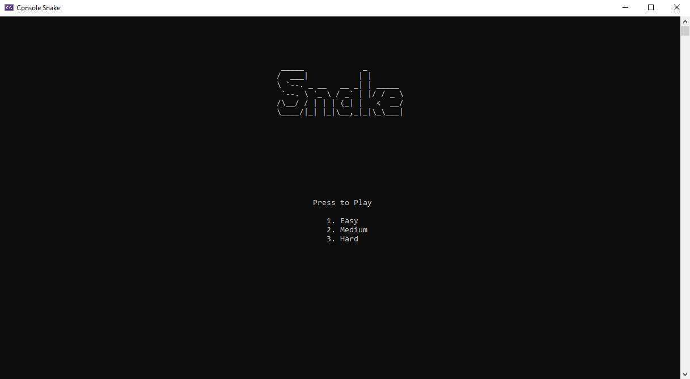
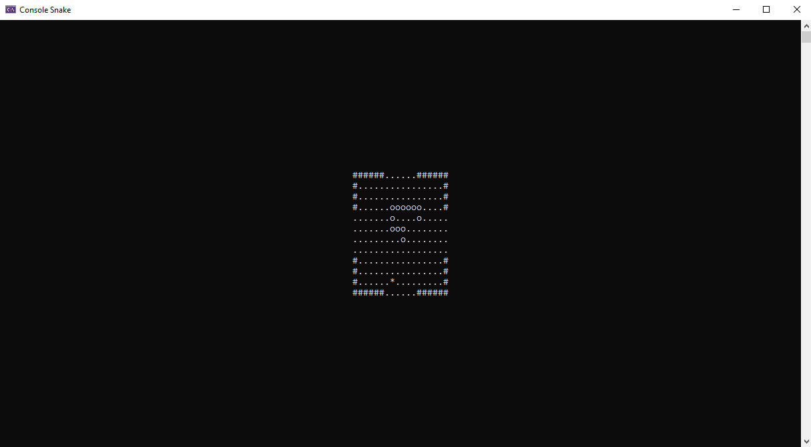

# Snake

## Sections

 - [Visuals](#visuals)
 - [Description](#description)
	 - [General](#general)
	 - [Main features](#main-features)
	 - [Programming languages and libraries](#programming-languages-and-libraries)
 - [Usage](#usage)
 - [Links](#links)

## Visuals

## Description

### General
Console version of the well-known snake game

### Main features
  - Snake mechanics
  - Three levels of difficulty

### Programming languages and libraries
 - C#

## Usage
 - Playing game
 
## Links
- http://patorjk.com/software/taag/#p=display&f=Graffiti&t=Type%20Something%20
